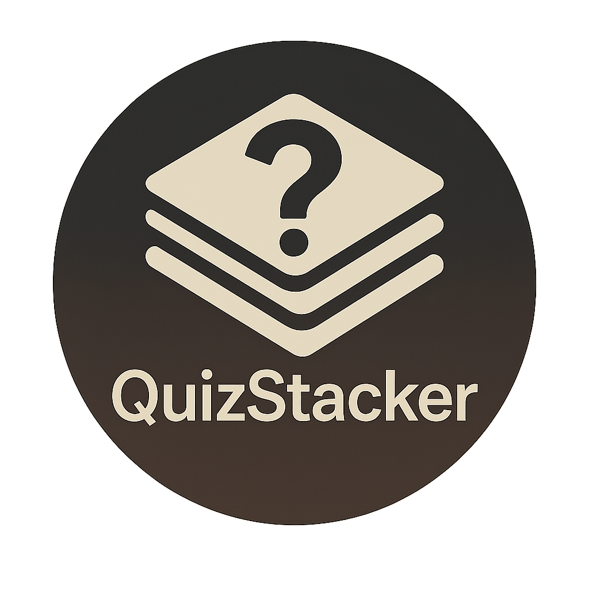

#  QuizStacker

QuizStacker is a fun, interactive quiz-based web application designed to test knowledge, improve learning, and make quizzes more engaging. Whether you're a student, developer, or just someone who loves trivia, QuizStacker makes it easy and enjoyable to stack up your knowledge!

<p align="center">
  
</p>
---

##  Features

-  **Multiple Categories**: Choose from various trivia categories like General Knowledge, Science, Tech, and more.
-  **Difficulty Levels**: Select quiz difficulty - Easy, Medium, or Hard.
-  **Randomized Questions**: Every session generates unique questions using the Open Trivia Database API.
-  **Modern UI**: Built with React and styled for an engaging user experience.
-  **Responsive Design**: Mobile-first approach ensures smooth performance across all devices.

---

##  Live Demo

[🔗 Click here to try QuizStacker](https://sadikxdev.github.io/QuizStacker/)

---

##  Tech Stack

- **Frontend**: React, CSS, HTML, Framer Motion
- **API**: [Open Trivia Database](https://opentdb.com/)
- **Version Control**: Git + GitHub
---

##  Getting Started

### Prerequisites
- Node.js and npm installed

### Installation

```bash
git clone https://github.com/sadikxdev/QuizStacker.git
cd QuizStacker
npm install
npm start

